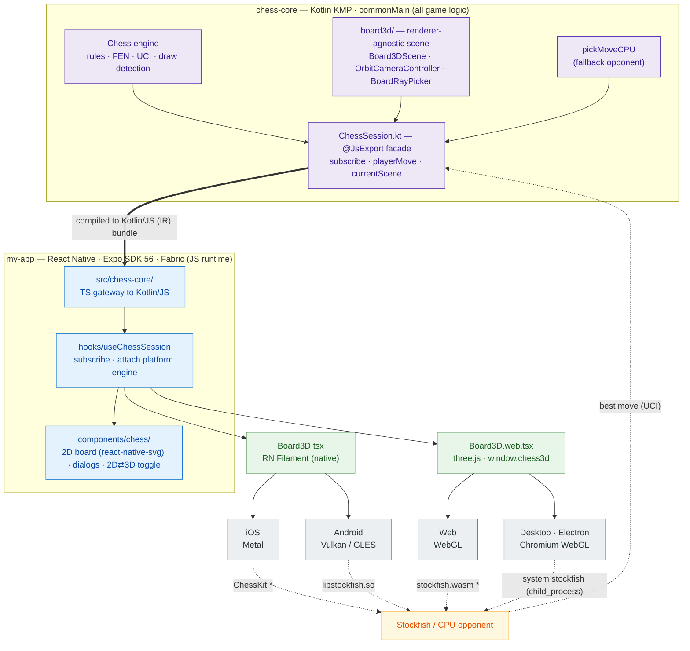

# React Native + Kotlin Multiplatform Chess

A cross-platform 3D chess app: a **React Native** shell with **all game logic in Kotlin**
(compiled to JavaScript via Kotlin/JS), and a clean **two-renderer split** for the 3D board —
**React Native Filament** (Metal/Vulkan) on native, **three.js** (WebGL) on web/Electron — both
driven by a single Kotlin scene model.

Rebuilt from [compose-multiplatform-chess](https://github.com/ber4444/compose-multiplatform-chess):
the Compose UI is replaced by React Native components, the four original 3D renderers collapse to
two, and the chess engine/rules/scene-math stay Kotlin (no logic reimplemented in JS/TS).

[Medium article](https://medium.com/@gabor.berenyi.california/building-a-3d-game-in-react-native-kotlin-multiplatform-526b3c2ddb6a)

## Why this design

- **One shell, five platforms.** iOS + Android run React Native natively (New Architecture /
  Fabric, via Expo); Web uses React Native Web; Desktop (Linux/macOS/Windows) is Electron hosting
  the RN Web build.
- **Two renderers, one scene model.** Native goes to **Filament** — the same engine the original
  Android backend used, so the PBR/IBL/material tuning and the `chess.glb` asset transfer directly,
  and iOS lands on a real Metal renderer (not deprecated `expo-gl`/GL ES). Web reuses the existing
  three.js renderer. Both consume the **same** Kotlin `Board3DScene`, so chess logic never knows
  which engine is underneath.
- **Logic stays Kotlin.** The KMP `chess-core` module compiles to a JS library that runs in the RN
  JS runtime on every platform. There is **no per-platform native FFI for game logic** — only
  Stockfish and the Filament renderer are native.

## Architecture

### System diagram

A single Kotlin core drives every platform. It compiles to a JS bundle that the React Native app
consumes; the same renderer-agnostic `Board3DScene` feeds two renderers; and a per-platform Stockfish
(or the Kotlin CPU fallback) closes the opponent-move loop back into the session.



> `*` = planned native engine; CPU fallback runs today. See the
> [Stockfish per platform](#stockfish-per-platform) table below for details.

### Directory layout

```
.
├── chess-core/                    # Kotlin KMP library → Kotlin/JS (IR)
│   └── src/commonMain/            #   All chess logic (rules, FEN, UCI, scene math)
│       ├── ChessSession.kt        #   @JsExport facade (subscribe, playerMove, currentScene, …)
│       └── board3d/               #   Renderer-agnostic scene/camera/picker model
│   └── src/commonTest/            #   Rules / FEN / scene / camera / draw test suite
├── my-app/                        # React Native app (Expo SDK 56, RN 0.85, Fabric)
│   ├── src/
│   │   ├── chess-core/            #   TS gateway to the Kotlin/JS bundle
│   │   ├── components/chess/      #   2D board (react-native-svg) + 3D board + dialogs
│   │   │   ├── Board3D.tsx        #     Native: RN Filament (Metal/Vulkan)
│   │   │   ├── Board3D.web.tsx    #     Web: three.js (window.chess3d, WebGL)
│   │   │   └── board-renderer/    #     BoardRenderer interface + three.js impl
│   │   ├── hooks/                 #   useChessSession (subscribe + platform engine attach)
│   │   └── constants/             #   strings + theme (ported from the source app)
│   ├── electron/                  # Electron main process + Stockfish child_process bridge
│   ├── android/                   # Android native project (Stockfish module + libstockfish.so)
│   ├── ios/                       # iOS native project
│   ├── assets/3d/                 # chess.glb, papermill IBL/skybox (source; split glbs generated)
│   ├── public/                    # Web assets (chess.glb, HDRs, stockfish.wasm)
│   └── scripts/                   # Asset generation (split glb, convert pieces, prepare renderer)
└── .github/workflows/ci.yml       # CI for all five platforms
```

### The two renderers

| Platform | 3D Renderer | Backend |
|---|---|---|
| iOS | React Native Filament | Metal |
| Android | React Native Filament | Vulkan / OpenGL ES |
| Web | three.js (`window.chess3d`) | WebGL |
| Desktop (Electron) | three.js | WebGL (Chromium) |

Camera orbit/zoom and tap-to-square picking are both routed through the Kotlin core
(`OrbitCameraController` / `BoardRayPicker`), so 2D and both 3D backends stay in sync — neither
renderer raycasts or animates on its own.

> **Note on native piece transforms:** the Filament backend writes each piece's transform
> *absolutely* via `TransformManager.setTransform` rather than the declarative `<ModelInstance>`
> transform props. Those props default to `multiplyWithCurrentTransform = true` and *accumulate* on
> every value change, which made animated pieces drift off the board. See the header comment in
> [`Board3D.tsx`](my-app/src/components/chess/Board3D.tsx) for the full explanation.

### Stockfish per platform

| Platform | Engine |
|---|---|
| Electron | System `stockfish` via Node `child_process` (UCI) |
| Android | Vendored `libstockfish.so` via `StockfishModule.kt` (UCI child process) |
| Web | `stockfish-18-lite-single.wasm` in a Web Worker *(planned; CPU fallback today)* |
| iOS | ChessKit `StockfishChessEngine` *(planned native module; CPU fallback today)* |

On any platform without a wired-up Stockfish, the Kotlin core's `pickMoveCPU` fallback plays Black —
so the opponent always moves.

## Features

Full parity with the source app: legal-move highlighting, castling, en passant, promotion dialog,
draw detection (threefold repetition / fifty-move / insufficient material), draw offers and
agreements, a 2D⇄3D toggle, a game-over popup, and a Stockfish-or-CPU opponent.

## Build

### Prerequisites

- **Node.js** 20+
- **JDK 21+** (for the chess-core Gradle build)
- **Xcode** (for iOS) / **Android Studio** + SDK (for Android)

### First-time setup

```bash
cd my-app
npm install
npm run build:core          # Gradle: compile chess-core → JS, copy into src/generated/
npm run prepare:assets      # Split chess.glb + convert piece SVGs + prepare the three.js renderer
```

`build:core` and `prepare:assets` produce generated files that are intentionally **not** committed
(they're reproducible) — run them once after cloning.

### Run

```bash
npm run web                 # Web (browser)
npm run build:desktop       # Desktop (Electron — builds web first, then launches)
npm run ios                 # iOS (simulator)
npm run android             # Android (emulator/device)
```

### Verify

```bash
npm run typecheck                       # TypeScript
npm run lint                            # ESLint
cd ../chess-core && ./gradlew jsNodeTest   # Kotlin core unit tests
```

## CI

[`.github/workflows/ci.yml`](.github/workflows/ci.yml) builds all five platforms on every push/PR:

| Job | Runner | What it checks |
|---|---|---|
| `chess-core` | ubuntu | Kotlin/JS build + `jsNodeTest` (the commonTest suite) |
| `app-web` | ubuntu | TypeScript + ESLint + `expo export` web bundle |
| `electron` | ubuntu | Syntax-checks the Electron main/preload + the `electron` binary |
| `ios` | macOS | `pod install` + `xcodebuild` (no code signing) |
| `android` | ubuntu | `./gradlew assembleDebug` |

## Regenerating assets

If `chess.glb` or the piece drawables change upstream, re-run `npm run prepare:assets`. Individual
generators:

- `scripts/split-chess-glb.js` — splits `assets/3d/chess.glb` → `assets/3d/split/*.glb`
- `scripts/convert-chess-pieces.js` — converts the vector XML drawables → `piece-paths.generated.ts`
- `scripts/prepare-3d-renderer.js` — derives the Metro-compatible `chess3d-renderer.generated.js`

## License

This project is licensed **GPL-3.0** — see [`LICENSE`](LICENSE). It is a port of
[compose-multiplatform-chess](https://github.com/ber4444/compose-multiplatform-chess), which is GPL-3.0 too. 
